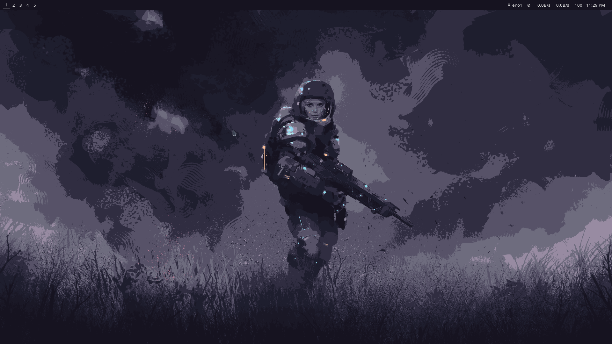
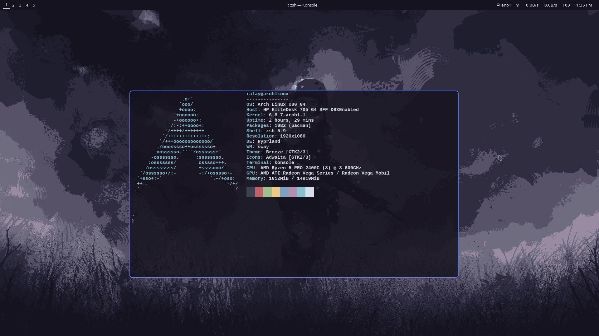

📁 **Dotfiles for Hyprland**

This repository contains my personal dotfiles for Hyprland Compositor, which are modified versions based on the fantastic work of [pineedaa](https://github.com/pineedaa/dotfiles/tree/master). Huge thanks to pineedaa for providing the foundation for these configurations.

## Dependencies

Make sure you have the following dependencies installed:

- [Waybar](https://github.com/Alexays/Waybar)
- [Kitty](https://sw.kovidgoyal.net/kitty/)
- [systemctl](https://www.freedesktop.org/software/systemd/man/systemctl.html)
- [playerctl](https://github.com/altdesktop/playerctl)
- [Hyprpaper](https://github.com/prateekmedia/hyprpaper)
- [Cliphist](https://github.com/cdown/cliphist)
- [Hyperidle](https://github.com/pineedaa/hyperidle)
- [Polkit](https://www.freedesktop.org/wiki/Software/polkit/)
- [polkit-gnome-agent](https://archlinux.org/packages/extra/x86_64/polkit-gnome/)
- [Hyprlock](https://github.com/pineedaa/hyprlock)
- [Wofi](https://hg.sr.ht/~scoopta/wofi)
- [Slurp](https://github.com/emersion/slurp)

## Fonts

To ensure proper rendering of icons and glyphs, download and install the following fonts:

[Overpass Nerd Font](https://github.com/ryanoasis/nerd-fonts/releases/download/v3.2.1/Overpass.zip)

## Acknowledgments
[pineedaa](https://github.com/pineedaa/dotfiles/tree/master) for the original dotfiles repository.
